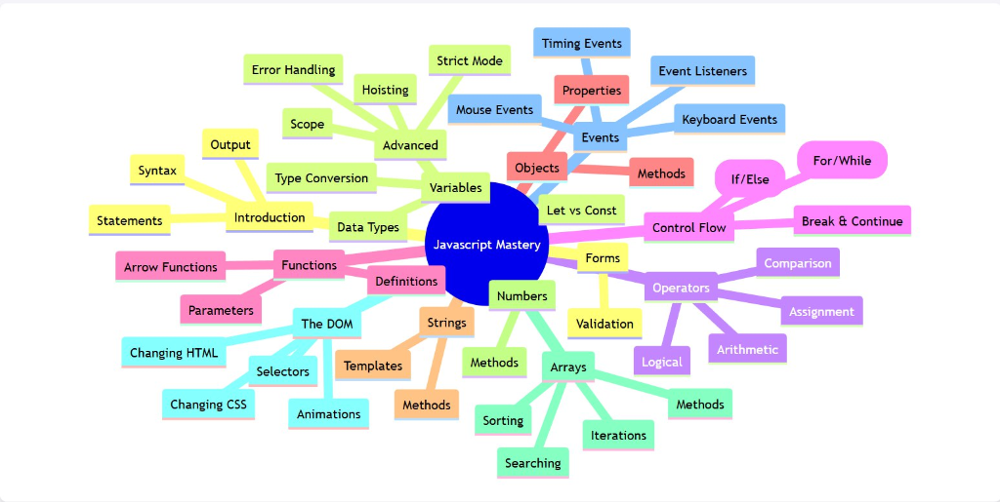

# Javascript Mastery

These are my personal way of studying javascript, by writing codes and notes as comment. If you think this is also an effective way for you guys, feel free to clone and learn!

## Overview
All the topics and learning materials are based on [W3Schools Javascript Tutorial](https://www.w3schools.com/js/), so strictly following their excellent syllabus. You can also check them out for more detailed explanations. Eventhough I actually think mine is more detailed explaination haha.

## Syllabus & Learned Topics

### 1. Fundamentals
- **Introduction**: Basic output, syntax, and linking scripts (`intro.html`, `whereto.html`).
- **Variables**: Declaring variables using `var`, `let`, and `const`. Understanding block scope vs function scope (`variables.html`, `let.html`, `const.html`).
- **Data Types**: String, Number, Boolean, Object, Array, Undefined. Using `typeof` (`types.js`, `DataTypes.html`).
- **Type Conversion**: Converting between strings, numbers, and booleans (`TypeConversion.html`).

### 2. Operators & Logic
- **Arithmetic & Assignment**: Basic math and value assignment (`arithmetic.html`, `assignment.html`).
- **Comparison & Logical**: Understanding `>`, `<`, `==`, `===` and Logical `&&`, `||`.
- **Short-circuit Evaluation**: How `&&` and `||` handle non-boolean values (`KeyDiffOperator.html`).

### 3. Control Flow
- **Conditionals**: Making decisions with `if`, `else`, `switch` (`conditionals.html`).
- **Loops**: Repeating code with `for` and `while` loops (`loops.html`).
- **Flow Control**: Using `break` and `continue` (`break.html`, `continue.html`).

### 4. Data Structures
- **Arrays**: Creating arrays, accessing elements.
    - **Methods**: `push`, `pop`, `shift`, `unshift`, `splice`, `slice` (`ReferenceArray.js`).
    - **Sorting & Searching**: `sort`, `reverse`, `find`, `filter` (`sortArray.html`, `searchArray.html`).
    - **Iteration**: Looping through arrays (`IterationsArray.html`).
- **Objects**: specialized file (`objects.html`).
- **Strings**: Manipulation, methods (slice, substring), and Template Literals (`strings.html`, `stringtemplates.html`).
- **Numbers**: Properties and methods (`numbers.html`).

### 5. Functions
- **Basics**: Declaration and invocation (`functions.html`).
- **Advanced**: Arrow functions vs Traditional functions (`3FunctionComparison.html`).

### 6. The DOM (Document Object Model)
- **DOM API**: Understanding the DOM tree (`HTMLDomAPI.html`).
- **Selectors**: Finding elements by ID, Class, Tag, QuerySelector (`SelectingDOMElements.html`).
- **Manipulation**:
    - **Content**: `innerHTML`, `textContent` (`ChangingHTML.html`).
    - **Styles**: `style` property, CSS classes (`ChangingCSS.html`).
    - **Animation**: Basic DOM animation (`HTMLDomAnimation.html`).

### 7. Events
- **Event Listeners**: `addEventListener`, bubbling vs capturing (`JavaScript HTML DOM EventListener.html`).
- **Types**:
    - Mouse: `click`, `mouseover`, `mouseout` (`mouseEvent.html`).
    - Keyboard: `keydown`, `keyup` (`keyboardEvent.html`).
    - Load: `onload` (`LoadEvents.html`).
    - Timing: `setTimeout`, `setInterval` (`timingvents.html`).

### 8. Web Forms
- **Validation**: validating user input (`formValidation.html`).

### 9. Asynchronous Programming
- **Callbacks**: Functions passed as arguments to be executed later (`callback,promises, async.html`).
- **Promises**: Objects representing eventual completion or failure of async operations.
    - **States**: pending, fulfilled, rejected.
    - **Methods**: `.then()`, `.catch()`.
- **Async/Await**: Cleaner syntax built on top of Promises.
    - **async** functions and **await** keyword.
    - **Try/Catch** error handling for async operations.

### 10. Web APIs & Fetch
- **Web APIs**: How to request data from servers on the internet (`fetch and web APIs.html`).
- **JSON**: JavaScript Object Notation for data exchange.
- **fetch()**: Making HTTP requests.
    - **Basic fetch with .then() and .catch()**.
    - **Async/await approach (recommended)**.
    - **Error handling**: Checking `response.ok`.
    - **Displaying fetched data in HTML**.
- **Real-world usage**: Fetching triggered by user actions (clicks, form submissions, page loads).

### 11. Advanced Concepts
- **Scope**: Global, Function, and Block scope (`scope.html`).
- **Hoisting**: Variable and function hoisting behaviors (`scopeHoisting.html`).
- **Strict Mode**: `"use strict"` directive (`strictmodeScope.html`).
- **Error Handling**: `try`, `catch`, `throw`, `finally` (`Errors.html`).
